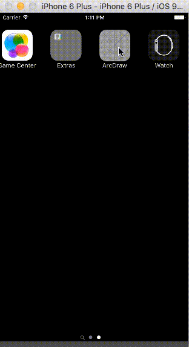

# ArcDraw-iOS


Autolayout arc draw sample view

### Code
- ArcImageView : UIImageView
- ArcView : UIView
```objc
@property (nonatomic) IBInspectable BOOL clockWise;
@property (nonatomic, strong) IBInspectable UIImage *fillImage;
@property (nonatomic, strong) IBInspectable UIImage *backImage;
```
Simple to use

  `[arcView cropStartAngle:0 endAngle:filledAngle];`

### Demo view

